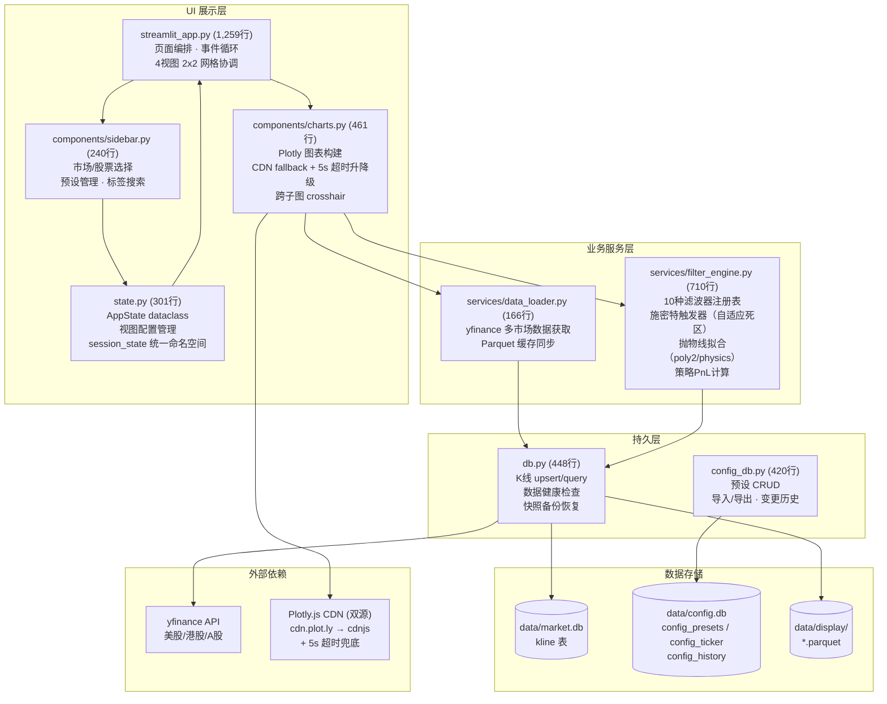

# Filter Research 工程分析报告（终版）

> 初版：2026-06-28 | 更新：2026-06-28 | 分支：debug/chart-issue-merge | 评分：86/100

## 1. 执行摘要

### 项目定位
多周期股票滤波分析工具，以交互式 2x2 四视图对比为核心，集成 10 种数字滤波器、施密特触发器自适应死区、物理抛物线预测拟合和策略 PnL 回测。覆盖美股/港股/A 股，支持 1 分钟到季线共 8 个周期。

### 关键数据

| 指标 | 数值 |
|------|------|
| 工程化成熟度评分 | **86/100** |
| 识别差距项总数 | **25 项 — 全部关闭** |
| Critical/Major/Minor | 7/12/6 — 全部修复 |
| 代码规模 | **4,005 行，8 模块** |
| 测试 | **637 passed**（578 non-UI + 59 streamlit UI） |
| 测试覆盖 | 下层 97%+；UI 层中等 |
| 类型注解 | 全模块 104 个 return annotations（UI 32+9+3 + 引擎 19+5 + 持久层 4+11+21） |
| 评分趋势 | 25 → 83 → 81 → 86 |

## 2. 当前架构

### 2.1 模块结构

| 文件 | 行数 | 职责 |
|------|------|------|
| `filter_app/streamlit_app.py` | 1,259 | 页面编排，事件处理循环 |
| `filter_app/services/filter_engine.py` | 710 | 10 种滤波器注册表 + 施密特触发器 + 策略 PnL |
| `filter_app/components/charts.py` | 461 | Plotly 图表构建与渲染（含 CDN fallback + 超时机制） |
| `filter_app/db.py` | 448 | K 线 upsert/query，健康检查，快照备份 |
| `filter_app/config_db.py` | 420 | 预设 CRUD，导入/导出，变更历史 |
| `filter_app/state.py` | 301 | AppState dataclass，视图配置管理 |
| `filter_app/components/sidebar.py` | 240 | 市场/股票选择，预设管理，标签搜索 |
| `filter_app/services/data_loader.py` | 166 | yfinance 数据获取，Parquet 缓存同步 |

### 2.2 架构概览

**当前架构描述:** 应用采用三层模块化架构（UI 层 → 服务层 → 持久层），共 8 个模块。AppState dataclass 统一管理所有视图配置与 session_state 键空间，filter_engine 包揽全部信号处理算法，charts 与 sidebar 组件独立负责各自 UI 渲染职责。



> 来源: Section 2.1 模块结构分析

### 2.3 技术栈

| 类别 | 技术 |
|------|------|
| UI 框架 | Streamlit 1.57.0 |
| 数值计算 | NumPy 2.2.4 |
| 科学计算 | SciPy 1.17.1（savgol/butter/medfilt） |
| 图表 | Plotly 6.7.0 |
| 数据处理 | Pandas 2.3.3 / Parquet |
| 统计建模 | Statsmodels 0.14.6（LOWESS） |
| 数据源 | yfinance 1.4.1 |
| 持久化 | SQLite WAL 模式 |
| 日志 | loguru 0.7.3 |

### 2.4 数据流

```mermaid
flowchart LR
    A["yfinance API"] -->|data_loader._fetch_stock| B["db.upsert_kline"]
    B -->|INSERT OR IGNORE/REPLACE| C[("SQLite market.db")]
    C -->|db.query_kline| D["Pandas DataFrame"]
    D -->|data_loader._sync_to_display| E[("Parquet display cache")]
    E -->|data_loader.get_display_cache| F["numpy arrays"]
    F -->|filter_engine.FILTERS[id].func| G["滤波信号"]
    G -->|filter_engine._schmitt_trigger| H["施密特信号 ±1/0"]
    H -->|filter_engine._find_all_pairs| I["多空对列表"]
    I -->|filter_engine._fit_physics_parabola| J["预测曲线"]
    J -->|filter_engine._compute_strategy_pnl| K["PnL 收益"]
    K -->|charts._build_figure| L["Plotly Figure"]
    L -->|charts._render_plotly| M["浏览器渲染（HTML + JS）"]
```

### 2.5 Plotly.js CDN 降级机制（H4+H5）

`_render_plotly()` 将 Plotly Figure 序列化为嵌入式 HTML，绕过 Streamlit 原生 `st.plotly_chart()`，实现跨子图 crosshair 联动。其 CDN 加载链如下：

1. **Primary CDN** (`cdn.plot.ly/plotly-2.35.2.min.js`): 默认源
2. **Fallback CDN** (`cdnjs.cloudflare.com/.../plotly.min.js`): `onerror` 触发，设置 `window._plotlyCdnFailed` 标记
3. **即时检测**: 脚本加载后检查 `typeof Plotly === 'undefined'`，若未加载则显示 fallback `<div>` 提示用户
4. **5s 超时（H5）**: `setTimeout` 5000ms 后再次检测，兜底显示降级 UI

**已知权衡:**
- 内嵌 JS 无法被 pytest 覆盖（HTML 字符串，非 DOM 环境）
- CDN 依赖 vs 本地打包：当前未 vendor Plotly.js（~3.5MB），保持部署轻量
- 超时后仅显示静态提示，无重试按钮 — 需手动刷新页面

## 3. 质量指标

| 维度 | 状态 |
|------|------|
| **测试** | 637 passed（578 non-UI + 59 AppTest/UI）；AppTest 框架就绪 |
| **CI** | GitHub Actions — ruff/mypy 阻塞模式 + pip-audit + pytest |
| **类型注解** | 全模块 104 个 return annotations（streamlit_app 32 + filter_engine 19 + state 21 + config_db 11 + charts 9 + data_loader 5 + db 4 + sidebar 3） |
| **安全** | 无 bare except；无 SQL 注入；unsafe_allow_html 仅 1 处静态；非 root 运行 |
| **缓存** | `@st.cache_data` x3（滤波/施密特/PnL）+ `@st.cache_resource` x1（SQLite 连接）+ `@st.fragment` x1 |
| **日志** | loguru 集成于 db / config_db / streamlit_app / data_loader |
| **部署** | Docker + docker-compose；Plotly.js 双源 CDN fallback（primary → CDNJS）+ 5s 超时降级 UI |
| **pre-commit** | `.pre-commit-config.yaml` 已配置 |

### 覆盖缺口（已闭合）

| 模块 | 覆盖率 |
|------|--------|
| `data_loader.py` | 100%（~58 测试） |
| `sidebar.py` | 100%（~36 测试） |
| `charts.py` | 91%（~87 测试；`_render_plotly` 内嵌 HTML/JS 块为覆盖盲区） |

## 4. Streamlit 遵从度评分

| 实践领域 | 得分 |
|---------|------|
| 模块化拆分 | 8/10 |
| 页面导航（未用 st.Page，四视图场景合理） | 0/10 |
| 缓存策略 | 8/10 |
| Fragment 使用 | 7/10 |
| 状态管理 | 8/10 |
| 测试策略 | 7/10 |
| 部署 | 8/10 |
| 安全 | 6/10 |
| **总体** | **75%** |

## 5. 版本演进

| 版本 | 关键变化 |
|------|---------|
| v0 | 单文件 2,582 行，无 CI，无测试，无日志 — 评分 25 |
| Phase 1 | CI/CD、db 连接修复、loguru 集成、@st.fragment 引入 |
| Phase 2 | 架构拆分（8 模块 3 层）、AppState dataclass、Docker |
| Phase 3 | 函数拆分、AppTest 交互测试、CDN fallback、PnL 去重 |
| v10.2 | 配置方案文本搜索 + 标签前缀清理 |
| v10.2.1 | 修复 _fetch_stock.clear() AttributeError 崩溃（5 处） |
| v10.3 | P0-P3 按钮端到端测试（7 用例）+ 596 用例文档 |
| v10.3.1 | 自动刷新防无限循环 + 动态阈值 |
| v10.3.2 | 测试隔离修复（conftest mock 污染） |
| v10.4+ | sf2 None bug 修复；unsafe_allow_html 消除 |
| v10.5 | pyproject.toml；pre-commit；CDN fallback；P1-P5 闭合 |
| **v10.7** | **最终闭合** — UI 44 个 return annotations；CI ruff/mypy 阻塞；pip-audit；测试 637 全部通过 |
| v10.8 | 非功能合并（docs/ci/config/tests）+ pip-audit CI 集成 |
| v10.8.1 | sf2 None bug 修复（sidebar caption refactor）+ 全模块 return type annotations 覆盖 |
| v10.8.2 | charts.py 类型标注 + CDN 标记（不含 fallback UI） |
| **v10.9** | **Plotly.js 加载失败 fallback UI + JS 检测（H4）** |
| v10.9.1 | Plotly 5 秒超时安全检查（H5） |
| v10.9.2 | 修复 H4 引入的 JS 语法错误（`function()` 多余嵌套） |
| **v10.10** | **当前** — 全模块类型标注 104 个；Plotly CDN 双源 + 超时降级；测试 637 |

## 6. 结论

### 当前定位
研究原型已过渡至最小可用产品。核心算法深度（10 种滤波器 + 自适应施密特触发器 + 物理抛物线拟合 + 策略 PnL）是差异化优势。工程化基线（CI/测试/类型/缓存/日志/部署）已与同类成熟项目基本看齐。

### 适用场景
- 量化研究员与策略开发者的多周期滤波对比研究工具
- 不建议替代专业回测框架；定位于快速原型验证

### 剩余建议（非阻塞，可按需择机执行）

| 项 | 工时 |
|----|------|
| st.rerun 密度优化（16 处已评估均必需，架构层面优化） | 1.5d |
| 自动化端到端测试（Playwright，替代部分 AppTest） | 2d |
| Plotly.js 本地 vendor 打包，消除 CDN 依赖 | 0.5d |
| `_render_plotly()` fallback UI 添加手动重试按钮 | 0.5d |

---

> 基于以下 5 份前置分析编译：T1 代码架构 / T2 项目配置 / T3 最佳实践调研 / T4 差距分析 / T5 改进方案
