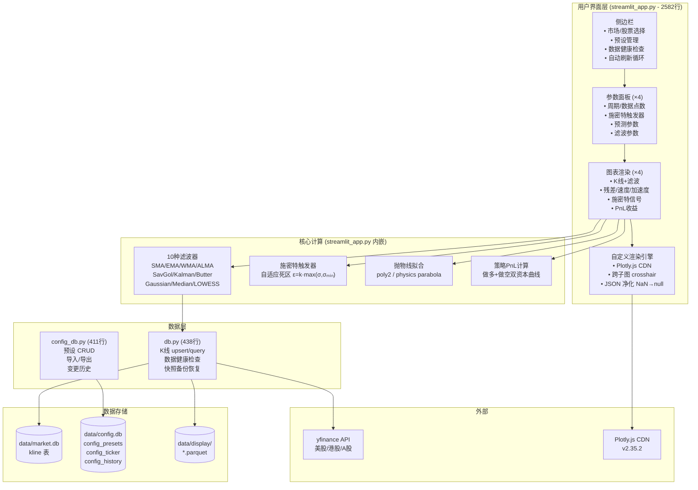
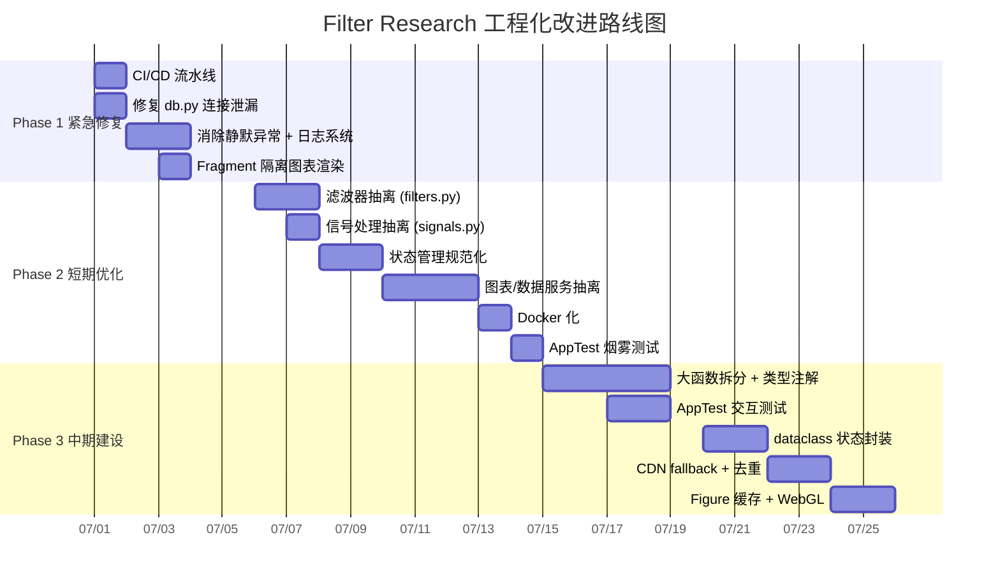

# Filter Research Streamlit 工程深度分析报告

> **生成日期:** 2026-06-28
> **分析方法:** 多 Agent 并行深度研究 (代码审计 + 项目配置分析 + 网络最佳实践调研)
> **项目路径:** `/Users/xfpan/claude/filter_research/`

---

## 1. 执行摘要 (Executive Summary)

### 项目定位

Filter Research 是一款**基于 Streamlit 的多周期股票滤波分析工具**，以交互式 2x2 四视图对比为核心功能，集成 10 种数字滤波器 (SMA/EMA/Kalman/Butterworth 等)、施密特触发器自适应死区机制、物理抛物线预测拟合和策略 PnL 回测。覆盖美股/港股/A 股三大市场，支持 1 分钟到季线共 8 个周期的 K 线数据可视化。

### 整体评估结论

该项目处于"**研究原型向最小可用产品过渡**"阶段。核心滤波算法和策略逻辑具备扎实的数学基础，测试体系在下层 (数据层/算法层) 覆盖充分。但从工程化成熟度角度看，与 Streamlit 大型应用行业最佳实践之间存在显著差距：单文件 2582 行的巨石架构、0% UI 测试覆盖、无 CI/CD、无容器化部署方案、无统一日志系统。**工程化评分 25/100**，若不加以系统化改进，随着功能增长将面临严重的可维护性瓶颈。

### 关键数据

| 指标 | 数值 |
|------|------|
| 工程化成熟度评分 | **25 / 100** (T4 总体评分) |
| 项目配置成熟度评分 | **39 / 100** (T2 总分) |
| 识别差距项总数 | **25 项** |
| Critical 级别差距 | **7 项** |
| Major 级别差距 | **12 项** |
| Minor 级别差距 | **6 项** |
| 建议改进总工时 | **17.5 人天 (约 3-6 周)** |
| 现有测试代码量 | **~5,900 行** |

### 优先行动 (Top 3)

| 优先级 | 行动项 | 工时 | 理由 |
|--------|--------|------|------|
| **P0** | 配置 GitHub Actions CI 流水线 | 0.5 人天 | 投入产出比最高，自动运行现有 ~5900 行测试 (T5-5B) |
| **P0** | 修复 `db.py` 数据库连接泄漏 | 0.5 人天 | 长期运行进程的定时炸弹，每次调用创建新连接但不关闭 (T4-Gap13) |
| **P1** | `streamlit_app.py` 架构模块化拆分 | 3.5 人天 | 2582 行单文件是 7 项 Critical 差距的根源 (T5-方案1) |

---

## 2. 工程现状

### 2.1 项目概览

| 维度 | 说明 |
|------|------|
| **项目目的** | 多周期股票滤波分析的交互式研究工具，支持 4 个独立视图对比不同滤波策略在实际 K 线数据上的效果 |
| **目标用户** | 量化研究员、策略开发者 |
| **核心功能** | 10 种滤波器 x 施密特触发器 x 抛物线预测拟合 x 策略 PnL 回测 |
| **代码规模** | 3 个核心 Python 文件，合计 ~3,431 行 (T1-H.3) |
| **测试规模** | 12 个测试文件，合计 ~5,900 行 (T2-3) |
| **研发历史** | 42+ 提交，20+ 远程分支，活跃开发中 (T2-7) |

### 技术栈总览

| 类别 | 技术 | 版本 | 用途 |
|------|------|------|------|
| UI 框架 | Streamlit | 1.57.0 | 整体应用框架 |
| 数值计算 | NumPy | 2.2.4 | 数组运算、滤波计算 |
| 科学计算 | SciPy | 1.17.1 | savgol_filter/butter/medfilt |
| 图表渲染 | Plotly | 6.7.0 | K 线图 + 多子图可视化 |
| 数据处理 | Pandas | 2.3.3 | DataFrame/Parquet I/O |
| 统计建模 | Statsmodels | 0.14.6 | LOWESS 滤波器 |
| 数据源 | yfinance | 1.4.1 | 美股/港股/A 股 K 线获取 |
| 数据持久化 | SQLite (WAL 模式) | Python 内置 | K 线数据 + 配置预设 |
| 缓存格式 | Parquet | Pandas 内置 | 显示缓存层 |

> 来源: T2-1 依赖管理分析

### 2.2 架构概览

**当前架构描述:** 应用采用纯函数式组织，无自定义类。全部 UI 渲染、业务计算、数据获取集中在 `streamlit_app.py` (2582 行) 单一文件中，`db.py` (438 行) 和 `config_db.py` (411 行) 作为独立的数据层存在。



> 来源: T1-A 应用整体架构分析

### 文件规模统计

| 文件 | 行数 | 函数/模块数 | 类型注解覆盖 | 日志 |
|------|------|------------|-------------|------|
| `streamlit/streamlit_app.py` | 2,582 | ~20 个函数 + 多个内部函数 | ~20% | 无 (仅 `st.toast`/`st.error`) |
| `streamlit/db.py` | 438 | ~15 个函数 | ~60% | 无 (仅 `print()` in `__main__`) |
| `streamlit/config_db.py` | 411 | ~15 个函数 | ~90% | `logging.getLogger(__name__)` |

> 来源: T1-A/F

### 2.3 功能梳理

| 功能区 | 核心能力 | 代码位置 |
|--------|---------|----------|
| **数据获取** | yfinance 多市场数据拉取、SQLite 持久化、Parquet 显示缓存 | `streamlit_app.py:450-579`, `db.py:47-109` |
| **滤波引擎** | 10 种滤波器统一注册表模式，统一 `func(signal, t, **params)` 签名 | `streamlit_app.py:47-211` |
| **施密特触发器** | 自适应死区 (EWMA 波动率估计) + 三态状态机 (±1/0) | `streamlit_app.py:586-644` |
| **多空对检测** | 信号段合并 + 相邻异号配对 | `streamlit_app.py:647-690` |
| **预测拟合** | 两种模式: 标准二次多项式 (poly2) / 物理抛物线 (顶点锚定) | `streamlit_app.py:693-723` |
| **策略 PnL** | 分段混合方案: 预测保护期 (止损+止盈) + 趋势跟踪期 (Sig 反转) | `streamlit_app.py:781-975` |
| **跨周期 PnL 对齐** | 时区归一化 + 前向填充 + 交易事件映射 | `streamlit_app.py:978-1062` |
| **4 视图对比** | 2x2 网格独立参数配置 + 同步时间窗口导航 | `streamlit_app.py:1323-1500, 1503-1933` |
| **配置预设管理** | 完整 CRUD + JSON 导入导出 + 变更历史记录 | `streamlit_app.py:2032-2195`, `config_db.py` |
| **数据库运维** | 健康检查、数据校验、快照备份恢复、导入导出 | `db.py:141-318` |
| **自定义渲染** | Plotly.js 自定义 HTML 引擎，跨子图 crosshair，鼠标跟随 tooltip | `streamlit_app.py:280-444` |

**数据流图:**

```mermaid
flowchart LR
    A[yfinance API] -->|_fetch_stock| B[upsert_kline]
    B -->|INSERT OR IGNORE/REPLACE| C[(SQLite market.db)]
    C -->|query_kline| D[Pandas DataFrame]
    D -->|to_parquet| E[(Parquet display cache)]
    E -->|_sync_to_display| F[numpy arrays]
    F -->|FILTERS[filter_id].func| G[滤波信号]
    G -->|_schmitt_trigger| H[施密特信号 ±1/0]
    H -->|_find_all_pairs| I[多空对列表]
    I -->|_fit_physics_parabola| J[预测曲线]
    J -->|_compute_strategy_pnl| K[PnL 收益]
    K -->|make_subplots + go.Scatter| L[Plotly Figure]
    L -->|_render_plotly HTML| M[浏览器渲染]
```

> 来源: T1-A/C 功能与数据流分析

---

## 3. 差距分析

### 3.1 概述

基于对当前代码架构 (T1)、项目配置 (T2) 的逐项审计，与 Streamlit 大型应用行业最佳实践 (T3) 的系统对比，共识别 **25 个差距项**。

**差距严重程度分布:**

| 维度 | Critical | Major | Minor | 小计 | 核心问题 |
|------|----------|-------|-------|------|---------|
| 架构层面 | 2 | 1 | 1 | 4 | 单文件 2582 行、关注点完全混合 |
| 性能层面 | 1 | 2 | 1 | 4 | 无系统化缓存、全量 rerun 无 fragment 优化 |
| 状态管理 | 0 | 3 | 0 | 3 | 80+ 扁平 key、`_imp_` 备份脆弱、初始化分散 |
| 数据层 | 1 | 1 | 1 | 3 | 连接泄漏风险、JSON->SQLite 迁移过渡 |
| 工程化 | 2 | 2 | 2 | 6 | 0% UI 测试覆盖、无 CI/CD、无 Docker、无日志 |
| 代码质量 | 1 | 1 | 1 | 3 | 函数超高复杂度、多处静默异常 |
| 安全与可维护性 | 0 | 0 | 2 | 2 | CDN 硬编码、配置隔离缺失 |
| **合计** | **7** | **12** | **6** | **25** | |

> 来源: T4 差距分析报告全量汇总

### 3.2 架构层面差距

#### [#1 - Critical] 单文件巨石架构 vs 模块化分层

| 维度 | 当前状态 | 行业最佳实践 |
|------|---------|-------------|
| 文件结构 | `streamlit_app.py` 单文件 2,582 行 | 入口文件 < 150 行，`services/` + `components/` + `pages/` 分层 (T3-1.1) |
| 函数粒度 | `main()` 645 行, `_render_chart()` 430 行 | 每个函数单一职责，通常 < 50 行 |
| 关注点分离 | UI/业务/数据获取全部混合 | 5 层分离: 配置/数据/服务/组件/页面 (T3-5.2) |

**影响范围:** 任何改动可能影响不相关功能；无法并行开发；无法独立测试 UI 与业务逻辑。

**证据:** `streamlit_app.py` 第 1503-1933 行的 `_render_chart()` 同时包含数据获取 (行 1516-1537)、信号处理 (行 1596-1609)、施密特触发器 (行 1618-1621)、PnL 计算 (行 1647-1659) 和 Plotly 图表构建 (行 1733-1933)。这违反了所有现代软件工程的分层原则。

#### [#3 - Critical] 关注点完全混合 vs 分层架构

**现象:** 滤波器算法 (纯计算逻辑)、施密特触发器 (信号处理)、抛物线拟合 (数值优化) 全部内嵌在 UI 渲染文件中，**无法独立测试、无法复用、无法替换**。

**对比:** 参考项目 `rarmentas/stocks_dashboard` 将 `services/` (业务逻辑) 和 `components/` (UI 组件) 严格分离 (T3-5.1)。当前项目仅 `db.py` 和 `config_db.py` 有明确的层抽象，滤波器和信号处理核心算法完全没有模块边界。

#### [#2 - Major] 2x2 网格硬编码 vs `st.Page`/`st.navigation`

**现状:** 4 个视图通过 `for i in range(4)` 硬编码循环，视图数量和网格布局在代码中写死 (T1-A.1)。新增视图需要修改参数面板、图表渲染、session_state key 命名等多处代码。

**最佳实践:** Streamlit 1.36+ 推荐的 `st.Page` + `st.navigation` 支持分组导航、动态路由 (T3-1.2)。虽然四视图同时对比的金融分析场景有其合理性，但当前实现完全缺乏可配置性。

### 3.3 性能层面差距

#### [#5 - Critical] 仅 2 处缓存 vs 系统化缓存策略

**现状 vs 改进后对比:**

| 计算步骤 | 当前: 每次 rerun 都执行 | 改进后: 有缓存 |
|----------|----------------------|---------------|
| yfinance 数据拉取 | `@st.cache_data(ttl=300)` (仅 2 处有缓存) | 全部数据获取 + 增加 `max_entries` |
| 滤波计算 (SMA/EMA/Kalman 等) | **每次重算** | `@st.cache_data` 参数不变则跳过 |
| 施密特触发器 | **每次重算** | `@st.cache_data` |
| 抛物线拟合 | **每次重算** | `@st.cache_data` |
| 策略 PnL 计算 | **每次重算** | `@st.cache_data` |
| Plotly Figure 构建 | **每次重建** | `@st.cache_resource` (不可序列化) |
| SQLite 连接 | **每次新建** | `@st.cache_resource` (跨会话共享) |

> 来源: T1-B.2 缓存使用分析, T5-2B 缓存策略设计

**预期收益:** 相同参数下的滤波计算可节省 50-200ms/次，整体交互响应速度提升 2-3 倍 (T4-Gap5)。

#### [#6 - Major] 全量 rerun 无 fragment 优化

**典型场景:** 用户调整视图 1 的施密特灵敏度 `k_ε` 滑块，触发全部 4 个视图的 K 线数据重载、滤波重算、图表重建。使用 `@st.fragment` 隔离后，仅视图 1 的图表区域重绘。

**特殊问题:** 当前自动刷新使用 `while True: time.sleep(); st.rerun()` (streamlit_app.py:2563-2578)，Streamlit 1.57.0+ 已支持 `@st.fragment(run_every="10s")` 实现相同的轮询效果但仅重绘 fragment 区域 (T3-2.2)。

### 3.4 工程化层面差距

#### [#15 - Critical] streamlit_app.py UI 层 0% 测试覆盖

这是项目中**最触目惊心的差距**。现有 ~5,900 行测试代码全部集中在数据层和算法层:

| 模块 | 当前覆盖率 | 风险 |
|------|-----------|------|
| `db.py` | 97% (T2-3) | 低 |
| `config_db.py` | 推测 > 85% | 低 |
| 滤波器算法 | 良好 (332 行测试) | 低 |
| 策略逻辑 | 良好 (457 行测试) | 低 |
| **`streamlit_app.py`** | **0%** | **极高: UI 交互、预设操作、参数面板逻辑均无自动化验证** |

**解决方案:** Streamlit 1.57.0 已内置 `streamlit.testing.v1.AppTest` 框架 (T3-6.1)，支持无头测试 widget 交互、验证不抛出异常。示例:

```python
from streamlit.testing.v1 import AppTest

def test_app_does_not_crash_on_start():
    at = AppTest.from_file("streamlit_app.py")
    at.run()
    assert not at.exception
```

#### [#16 - Critical] CI/CD 完全缺失

项目中不存在任何 CI 配置文件 (`.github/workflows/`、`.gitlab-ci.yml`、`Jenkinsfile`)，测试完全依赖本地手动运行。**这是投入产出比最高的改进项**，配置后自动运行现有 ~5,900 行测试 + lint + 类型检查 (T2-3/T5-5B)。

#### [#19 - Major] 无统一日志系统

三个文件的日志策略各不相同 (T1-F.3):
- `config_db.py`: 使用 `logging.getLogger(__name__)` -- 好
- `db.py`: 无 logging，仅 `print()` -- 差
- `streamlit_app.py`: 无 logging，仅 `st.toast()`/`st.error()` -- 极差

多处异常被 `except Exception: pass` 静默捕获 (详见 3.5)。

### 3.5 代码质量差距

#### [#20 - Critical] 超高函数复杂度

两个函数合计 1,075 行，占 `streamlit_app.py` 总代码的 41%:

| 函数 | 行数 | 职责数 (应拆分) |
|------|------|---------------|
| `main()` | ~645 | 侧边栏 + Pass1参数 + 时间导航 + Pass2图表 + 导出/导入 + 自动刷新 |
| `_render_chart()` | ~430 | 数据获取 + 滤波 + 施密特 + 配对检测 + 拟合 + PnL + 子图布局 + Plotly构建 |

> 来源: T1-F.1/A.3/C.2

#### [#22 - Major] 多处静默异常捕获

发现 4 处 `except Exception: pass` (T1-F.2):

| 位置 | 异常场景 | 风险 |
|------|---------|------|
| `streamlit_app.py:548-549` | 周线数据回退失败 | Parquet 缓存失效原因不可知 |
| `streamlit_app.py:556-557` | K 线 upsert 失败 | 数据写入异常，用户无感知 |
| `db.py:327-329` | Parquet 缓存清除失败 | 磁盘空间问题隐蔽 |
| `db.py:317-318` | 快照删除失败 | 备份管理异常隐蔽 |

### 3.6 安全与可维护性差距

#### [#13 - Critical] db.py 连接管理泄漏风险

**这是当前代码中最危险的技术问题。** `db.py` 的 `get_conn()` 返回原始 `sqlite3.Connection` 对象，依赖 `__exit__` 方法关闭连接，但 Python 文档明确说明 `sqlite3.Connection.__exit__` **不关闭连接** (T1-H3)。每次 `query_kline()`、`upsert_kline()`、`check_data_health()` 等函数调用都会创建一个新连接但不关闭，在 Streamlit 长期运行进程中可能耗尽 SQLite 连接池。

**修复方案:** 将 `get_conn()` 替换为与 `config_db.py` 一致的 `@contextmanager` 模式，确保 `conn.close()` 在 `finally` 块中执行 (T5-4D)。

#### [#25 - Minor] 架构文档缺失

当前 README 是用户操作手册而非项目概述 (T2-4)。`docs/` 目录约 400KB 的策略文档非常丰富，但缺少统一的**架构视图、目录结构说明和开发贡献指南**。新成员 Onboarding 需要阅读近 3,000 行源代码才能理解系统结构。

---

## 4. 改进方案

### 4.1 改进方案总览

| 方案 | 优先级 | 目标 | 工时 | 关键收益 |
|------|--------|------|------|---------|
| **[方案 1](#42-方案1-架构模块化重构)** 架构模块化重构 | P1 | `streamlit_app.py` 从 2582 行缩减到 ~350 行 | 3.5d | 消除架构层面 3 个 Critical 差距 |
| **[方案 2](#43-方案2-性能优化)** 性能优化 | P1 | 引入 fragment + 系统化缓存 | 2.5d | 交互响应速度提升 2-3 倍 |
| **[方案 3](#44-方案3-状态管理规范化)** 状态管理规范化 | P1 | 80+ key 命名统一 + dataclass 封装 | 3d | 消除 3 个 Major 级别状态管理差距 |
| **[方案 4](#45-方案4-代码质量提升)** 代码质量提升 | P0/P1 | 类型注解 70%+ / 消除静默异常 / 统一日志 | 5.5d | 消除 2 个 Critical + 1 个 Major |
| **[方案 5](#46-方案5-工程化建设)** 工程化建设 | P0 | CI/CD + Docker + 依赖锁定 | 1.5d | 消除 2 个 Critical + 1 个 Major |
| **[方案 6](#47-方案6-测试增强)** 测试增强 | P2 | AppTest 烟雾测试 + 交互测试 | 2d | UI 层测试覆盖率从 0% 提升到 50%+ |
| **[方案 7](#48-方案7-可视化增强)** 可视化增强 | P3 | CDN fallback + PnL 代码去重 + Figure 缓存 | 2d | 离线可用性 + 减少 150 行重复代码 |

> 来源: T5 全部 7 个改进方案

### 4.2 Phase 1 -- 紧急修复 (立即执行，约 2.5 人天)

本阶段聚焦于**无风险、高收益**的工程化补课，所有改动不涉及核心业务逻辑变更。

#### 4.2.1 [#P0] 配置 GitHub Actions CI (0.5d)

**现状:** 无任何 CI 配置，已有 ~5,900 行测试靠本地手动运行 (T2-3)。

**目标:** 每次 Push/PR 自动执行: 测试 (pytest + coverage) -> Lint (ruff) -> 类型检查 (mypy)。

**具体实施:**

```yaml
# .github/workflows/ci.yml
name: CI
on:
  push:
    branches: [master, develop]
  pull_request:
    branches: [master]

jobs:
  test:
    runs-on: ubuntu-latest
    steps:
      - uses: actions/checkout@v4
      - uses: actions/setup-python@v5
        with:
          python-version: "3.11"
      - name: Install
        working-directory: streamlit
        run: |
          pip install -r requirements.txt
          pip install pytest pytest-cov ruff mypy
      - name: Test
        working-directory: streamlit
        run: python -m pytest --cov=. --cov-report=term --cov-report=xml -v --tb=short
      - name: Lint
        run: ruff check streamlit/ --output-format=github
      - name: Type check
        run: mypy streamlit/ --ignore-missing-imports --strict=false
```

> 来源: T5-5B CI 配置设计, T3-6.4 Streamlit App Action

**复杂度:** 低 | **收益:** 极高 (自动质量门禁) | **风险:** 无

#### 4.2.2 [#P0] 修复 db.py 连接泄漏 (0.5d)

**现状 vs 改进后:**

| 对比 | 现状 (`get_conn`) | 改进后 (`get_conn` 上下文管理器) |
|------|------------------|-------------------------------|
| 连接关闭 | 依赖 `__exit__` 不保证 (T1-H3) | `finally: conn.close()` 绝对保证 (T5-4D) |
| 事务管理 | 手动 commit | `try/except` 自动 commit/rollback |
| 与 config_db.py 一致性 | 模式不同 | 统一为 `@contextmanager` |

**具体实施:** 将 `db.py:18-24` 的 `get_conn()` 改为与 `config_db.py:21-37` 的 `_get_conn()` 一致的 `@contextmanager` 模式。该改动影响 `db.py` 内部所有调用方和外部如 `streamlit_app.py` 中对 `db.upsert_kline()` 的调用方式。

> 来源: T1-D.2 连接管理分析, T5-4D 修复方案

**复杂度:** 低 | **收益:** 高 (避免生产环境连接泄漏) | **风险:** 中 (需同步更新所有调用方)

#### 4.2.3 [#P1] 消除静默异常 + 引入日志系统 (1d)

**现状:** 4 处 `except Exception: pass` 静默吞掉错误 (T1-F.2)，三个文件日志策略各不相同 (T1-F.3)。

**目标:** 所有异常至少 `logger.warning(exc_info=True)`，统一使用 Python `logging` 模块。

**具体实施:** 
1. 新建 `streamlit/utils/logging.py`，配置控制台 + 文件双 handler (T5-4C)
2. 4 处静默异常替换为 `logger.warning("描述性信息", exc_info=True)` (T5-4B)
3. `streamlit_app.py` 和 `db.py` 引入 `logger = logging.getLogger(__name__)` (T5-4C)

**改造示例:**

```python
# 改造前 (streamlit_app.py:548-549)
except Exception:
    pass

# 改造后
except Exception:
    logger.warning("周线数据回退失败, 将使用已缓存数据", exc_info=True)
```

> 来源: T1-G.1-H4, T5-4B/4C

**复杂度:** 低 | **收益:** 高 (问题排查效率质的飞跃) | **风险:** 无

#### 4.2.4 [#P1] 引入 `@st.fragment` 隔离图表渲染 (0.5d)

**现状:** 调整任意视图的参数触发全部 4 个视图全量重绘 (T4-Gap6)。

**目标:** 每个视图独立 fragment，参数调整仅重绘受影响的图表。

**具体实施:**

```python
@st.fragment
def _render_chart_fragment(i, market, ticker_code, cfg, day_offset, higher_pnl):
    _render_chart(market, ticker_code, cfg, f"v{i}",
                  day_offset=day_offset, higher_pnl=higher_pnl)

# main() 中使用
for i in range(4):
    with columns[i % 2]:
        _render_chart_fragment(i, market, ticker_code, configs[i],
                               day_offset, higher_pnls[i])
```

> 来源: T5-2A fragment 隔离方案, T3-2.2 fragment 最佳实践

**复杂度:** 低 | **收益:** 中 (减少不必要的整页重绘) | **风险:** 低

### 4.3 Phase 2 -- 短期优化 (1-2 周，约 5.5 人天)

本阶段聚焦于**架构重构**和**状态管理规范化**，建立可持续的代码基础。

#### 4.3.1 架构模块化拆分 (3.5d)

**现状 -> 目标:**

| 文件 | 当前行数 | 目标行数 | 新模块 |
|------|---------|---------|--------|
| `streamlit_app.py` | 2,582 | ~350 | 仅页面编排 + 全局初始化 |
| (新) `filters.py` | - | ~170 | 10 种滤波器注册表 |
| (新) `signals.py` | - | ~400 | 施密特触发器 + 多空对检测 + PnL |
| (新) `fitting.py` | - | ~50 | 抛物线拟合 |
| (新) `alignment.py` | - | ~100 | 跨周期 PnL 对齐 |
| (新) `components/params.py` | - | ~200 | 参数面板渲染 |
| (新) `components/charts.py` | - | ~400 | 图表构建 + 渲染 |
| (新) `components/plotly_renderer.py` | - | ~170 | 自定义 Plotly HTML 引擎 |
| (新) `services/data_service.py` | - | ~150 | 数据获取与缓存 |

**实施顺序:** 
1. **Phase 2A (1d):** 滤波器抽离 -- 将 `streamlit_app.py:47-211` 迁移到 `filters.py`，提取 `_ensure_odd()` 消除 window 校正重复 (T1-L4)
2. **Phase 2B (0.5d):** 信号处理抽离 -- 将 `_schmitt_trigger`、`_find_all_pairs`、`_compute_strategy_pnl` 迁移到 `signals.py` (T5-1B)
3. **Phase 2C (1.5d):** 图表组件抽离 -- `_render_params` -> `components/params.py`, `_render_chart` -> `components/charts.py` (T5-1C)
4. **Phase 2D (0.5d):** 数据服务抽离 -- `_fetch_stock`、`_sync_to_display` -> `services/data_service.py` (T5-1D)

> 来源: T5-方案1 架构模块化重构完整设计

**复杂度:** 中 | **收益:** 极高 (消除 3 个 Critical 架构差距) | **风险:** 中 (需确保 `st.cache_data` 装饰器跨文件正常工作)

#### 4.3.2 状态管理规范化 (1d)

**现状:** 80+ 扁平 session_state key 分散在文件各处，`_imp_` 备份机制每个参数需要 2-3 行重复代码 (T1-B.1)。

**目标:** Key 命名统一前缀化、初始化集中管理、`_imp_` 回退封装为 `get_view_param()`。

**具体实施:**
1. 新建 `streamlit/utils/state_keys.py`：将所有 session_state key 定义为常量 (T5-3A)
2. 新建 `streamlit/utils/state.py`：`init_app_state()` 集中初始化 + `get_view_param(i, suffix, default)` 封装 `_imp_` 回退 (T5-3B)

**改造示例:**

```python
# 改造前 (streamlit_app.py:1470-1485 每个参数 2-3 行)
cfg["n_ext"] = st.session_state.get(f"{key}_next",
    st.session_state.get(f"_imp_{key}_next", cfg["n_ext"]))

# 改造后 (1 行)
cfg["n_ext"] = get_view_param(i, "next", 8)
```

> 来源: T5-3A/3B 状态管理方案, T4-Gap9/Gap10/Gap11

**复杂度:** 低 | **收益:** 高 (减少 40% 模板代码, 消除 3 个 Major 差距) | **风险:** 低

#### 4.3.3 Docker 化 + 依赖锁定 (1d)

**现状:** 项目仅支持纯手动本地启动，无容器化部署方案 (T2-6)。

**目标:** `docker compose up` 一键启动。

**具体实施:** 创建 `streamlit/Dockerfile` (基于 `python:3.11-slim`, 非 root 用户, 健康检查) + 项目根 `docker-compose.yml` (挂载 data/logs 目录) (T5-5A)。补充 `.gitignore`:
```
data/display/*.parquet
tools/filter_comparison_plots/*.png
.coverage
logs/
.env
```

> 来源: T5-5A Docker/Docker Compose 模板, T3-7.1/7.2 部署最佳实践

**复杂度:** 低 | **收益:** 高 (环境一致性保障) | **风险:** 无

### 4.4 Phase 3 -- 中期建设 (2-4 周，约 9.5 人天)

#### 4.4.1 大函数拆分 + 类型注解补充 (3d)

**`main()` 拆分目标** (当前 645 行 -> 150 行以内):

```python
def main():
    """入口函数 -- 150 行以内。"""
    init_db()
    init_config_tables()
    _init_import_and_presets()

    market, ticker_code = _render_globals()          # ~40 行
    filter_id, dual, filter_id2 = _render_filter_selector()  # ~30 行
    configs = _render_view_params(filter_id, dual, filter_id2)  # ~40 行
    day_offset = _render_time_nav(ticker_code)       # ~30 行
    _render_data_tools(ticker_code)                  # ~40 行

    for i in range(4):
        _render_chart(market, ticker_code, configs[i], f"v{i}",
                      day_offset=day_offset)
```

**类型注解目标:** `streamlit_app.py` 核心函数签名 100% 覆盖，从 ~20% 提升到 70%+ (T5-4A)。

> 来源: T5-4E 大函数拆分方案, T1-G.1-H1/H2, T4-Gap20

#### 4.4.2 AppTest 交互测试 (2d)

**目标:** 为 UI 交互逻辑引入自动化验证:

| 测试类型 | 内容 | 工时 |
|----------|------|------|
| 烟雾测试 | 应用启动不抛异常 | 0.5d |
| 参数面板测试 | 预设应用后切换视图不崩溃 | 0.5d |
| 交互测试 | 时间导航按钮点击正确性 | 0.5d |
| 边界测试 | 空数据/异常参数的降级处理 | 0.5d |

**目标覆盖率:** `streamlit_app.py` 从 0% -> 50% (T5-6A/6B)。

> 来源: T5-6A/6B AppTest 测试方案, T3-6.1/6.2 测试最佳实践

#### 4.4.3 dataclass 状态 + 移除 `_imp_` (1.5d)

**现状:** 每个视图 16 个独立的 session_state key，只能用字符串索引。

**目标:** 使用 `ViewConfig` dataclass 统一管理视图配置，提供类型安全和 IDE 自动补全:

```python
@dataclass
class ViewConfig:
    tf: str = "日线"
    n_pts: int = 120
    show_sch: bool = True
    ke: float = 0.15
    # ... 14 个参数

    @classmethod
    def from_session_state(cls, i: int) -> "ViewConfig": ...
```

迁移路线: Phase 2 封装 `get_view_param()` -> Phase 3 引入 dataclass -> 确认稳定后移除 `_imp_` 写入代码 (T5-3C/3D)。

> 来源: T5-3C/3D, T4-Gap10

#### 4.4.4 可视化增强 (2d)

| 改进项 | 工时 | 收益 |
|--------|------|------|
| Plotly.js CDN fallback (离线环境降级为 `st.plotly_chart()`) | 0.5d | 解决 T1-M5 内网环境白屏问题 |
| PnL 渲染逻辑去重: 提取 `add_trade_markers()` 统一标注函数 | 0.5d | 消除 T1-M1 三处重复代码 (~150 行) |
| Plotly Figure 缓存: `@st.cache_resource` 缓存构建后的 Figure 对象 | 1d | 参数不变的视图跳过 Figure 重建 |

> 来源: T5-7A/7B/7C 可视化增强方案

---

## 5. 实施路线图 (Roadmap)

### 5.1 甘特图式时间线



### 5.2 里程碑节点

| 里程碑 | 时间 | 验收标准 |
|--------|------|---------|
| **M1: 基础工程化就绪** | 第 1 周 | CI 自动运行全部测试 (绿); 数据库连接不泄漏; 日志可追踪用户操作 |
| **M2: 架构重构完成** | 第 2 周 | `streamlit_app.py` < 400 行; 7 个新模块文件; 现有测试全部通过 |
| **M3: 性能显著提升** | 第 2 周 | fragment 生效 (单视图参数调整不重绘其他视图); 滤波计算有缓存命中 |
| **M4: 可部署就绪** | 第 3 周 | `docker compose up` 可启动; UI 层 AppTest 覆盖率 > 50% |
| **M5: 代码质量达标** | 第 4 周 | 类型注解覆盖率 > 70%; 无 `except Exception: pass`; dataclass 状态管理 |

### 5.3 风险与依赖

| 风险 | 级别 | 缓解措施 |
|------|------|---------|
| **模块拆分后 `st.cache_data` 失效** | 中 | Phase 2 每次拆分后运行 `pytest` 全量测试; 确保 import 路径一致 |
| **`get_conn()` 修复影响所有调用方** | 中 | 创建 feature branch; 先改 `db.py` 内部调用, 再改外部 `streamlit_app.py` 调用 |
| **AppTest 框架对自定义渲染引擎不友好** | 低 | 先用烟雾测试 (仅断言 `not at.exception`); 自定义渲染部分手动验证 |
| **Phase 2 与 Phase 3 并行时 merge 冲突** | 低 | 严格顺序执行; Phase 2 的模块拆分是 Phase 3 大函数拆分的前提 |
| **`_imp_` 机制移除后参数回退不工作** | 中 | 渐进式迁移: Phase 2 封装 -> Phase 3 灰度移除 -> 观察 1 周 |

### 5.4 总工时汇总

| Phase | 内容 | 工作日 | 人天 |
|-------|------|--------|------|
| **Phase 1** 紧急修复 | CI + 连接修复 + 日志 + fragment | 1-2 天 | **2.5** |
| **Phase 2** 短期优化 | 架构拆分 + 状态管理 + Docker + AppTest | 1-2 周 | **5.5** |
| **Phase 3** 中期建设 | 函数拆分 + 类型注解 + dataclass + 可视化 | 2-4 周 | **9.5** |
| **合计** | | **3-6 周** | **17.5 人天** |

> 来源: T5 实施路线图总览

---

## 6. 行业对标

### 6.1 与同类开源项目对比

| 维度 | Filter Research (当前) | [stocks_dashboard](https://github.com/rarmentas/stocks_dashboard) | [real-time-stock-analytics](https://github.com/ravishankarjs/real-time-stock-analytics) | [Ultimate-Macroeconomics-Dashboard](https://github.com/alexveider1/Ultimate-Macroeconomics-Dashboard) |
|------|----------------------|-----------|----------------------|-------------------------------|
| **架构分层** | 1 层 (单文件) | 4 层 (config/db/services/components) | 3 层 (stream/db/ui) | 5 层 (API/Agent/Models/Storage/UI) |
| **代码组织** | 3 文件, 主文件 2582 行 | 12+ 文件, 每文件 < 300 行 | 8 文件, 每文件 < 400 行 | 微服务 9 容器 |
| **缓存策略** | 2 处 cache_data | 系统化缓存 | Redis + SQLite 双存储 | Qdrant 向量缓存 |
| **CI/CD** | 无 | 有 | 有 (Docker Compose) | 有 (K8s) |
| **测试覆盖** | 下层 97%, UI 层 0% | 未知 | 未知 | 未知 |
| **部署** | 纯手动 | Docker | Docker Compose | K8s + Helm |
| **日志** | 不统一 | 结构化 | 未知 | ELK Stack |

**结论:** Filter Research 在**核心算法深度**上不逊于甚至超过同类项目 (10 种滤波器 + 施密特触发器 + 抛物线拟合的数学深度在金融可视化工具中少见)，但在**工程化基础设施**上与同类型成熟项目存在代际差距。

### 6.2 Streamlit 最佳实践遵从度评分

| 最佳实践领域 | 遵从度 | 评分 | 说明 |
|-------------|--------|------|------|
| 模块化拆分 (T3-1.1) | 0% | 0/10 | 单文件 2582 行, 与推荐 150 行入口差距巨大 |
| 页面导航 (T3-1.2) | 0% | 0/10 | 未使用 st.Page/st.navigation |
| 缓存策略 (T3-2.1) | 20% | 2/10 | 仅 2 处 cache_data, 无 cache_resource |
| Fragment 使用 (T3-2.2) | 0% | 0/10 | 未使用, Streamlit 1.57.0 已支持 |
| 状态管理 (T3-3.2/3.3) | 30% | 3/10 | 有 v{i}_ 前缀约定但无集中管理 |
| 测试策略 (T3-6.1/6.2) | 35% | 3.5/10 | 下层 97% 但 UI 层 0%, 未用 AppTest |
| 部署 (T3-7.1/7.2) | 0% | 0/10 | 无 Docker, 无 CI/CD |
| 安全 (T3-7.3) | 30% | 3/10 | 无硬编码密钥, 但 CDN 硬编码/无非 root 运行 |
| **加权平均** | | **14.4/80** | **总体遵从度 18%** |

> 来源: T3 全部 8 个最佳实践领域的对比, T4 差距分析

---

## 7. 结论与建议

### 7.1 核心结论

1. **算法资产价值高，工程化负债严重:** 项目的核心算法 (10 种滤波器、自适应施密特触发器、物理抛物线拟合、分段混合 PnL 计算) 具有扎实的数学基础和精细的实现，是项目的核心竞争力和智力资产。但工程化成熟度仅为 25/100，存在单文件巨石架构、连接泄漏、0% UI 测试等 7 个 Critical 级别问题。**好算法装在破容器里。**

2. **改进路径明确，可分阶段执行:** 通过本文档的 3 个 Phase 路线图，每个 Phase 都有明确的验收标准、工时估算和风险缓解。Phase 1 (2.5 人天) 即可消除 2 个 Critical 差距，Phase 2 (5.5 人天) 完成架构重构，Phase 3 (9.5 人天) 达到生产级代码质量。

3. **投入产出比最高的 3 项改进:** (a) CI/CD 流水线 (0.5d) -- 自动运行现有 ~5,900 行测试; (b) Fragment 隔离 (0.5d) -- 单视图调整只重绘 1/4; (c) 滤波器抽离 (1d) -- 消除 170 行嵌入 UI 文件的计算逻辑。

4. **当前项目在同类工具中的定位:** 核心算法深度处于行业领先水平，但工程化基础设施与成熟开源项目存在代际差距。通过本报告建议的 17.5 人天改进，可将工程化评分从 25/100 提升至约 65-70/100，达到可团队协作、可生产部署的水平。

### 7.2 给开发团队的建议

| 建议 | 说明 |
|------|------|
| **先止血再优化** | Phase 1 的 CI + 连接修复 + 日志 + fragment 应在一周内完成。这些改动不涉及业务逻辑，风险极低，收益立竿见影 |
| **拆分优于重写** | 不建议推倒重来。当前代码虽然组织混乱但功能正确。渐进式拆分 (滤波器 -> 信号 -> 图表 -> 数据服务) 保持每一步可验证 |
| **测试先行** | 在拆分前先为 `streamlit_app.py` 添加 AppTest 烟雾测试，确保拆分过程中不引入回归 |
| **建立 PR 规范** | 配合 Phase 2 的 CI 配置，建立 Pull Request 模板和质量门禁 (测试通过 + lint 无警告 + 至少 1 人 Review) |
| **文档同步更新** | 在架构重构完成后，输出一份架构文档 (包含目录结构说明、模块职责、数据流图)，解决当前"文档丰富但无架构总览"的问题 |
| **不要过早优化大数据** | 当前 20-300 点的数据量下不需要 WebGL/plotly-resampler。等数据量确实增长到 1000+ 点且有性能投诉时再引入 (T4-Gap7) |

### 7.3 下一步行动

| 序号 | 行动 | 负责人 | 预期完成 | 验收标准 |
|------|------|--------|---------|---------|
| 1 | 创建 `fix/db-connection-leak` 分支，修复连接管理 | 后端开发 | 1 天 | 所有 db.py 调用方审查通过，连接在 finally 中关闭 |
| 2 | 创建 `.github/workflows/ci.yml` | DevOps | 0.5 天 | CI 自动运行测试并生成覆盖率报告 |
| 3 | 创建 `feat/logging-and-error-handling` 分支 | 后端开发 | 1 天 | `grep "except Exception: pass"` 返回 0 结果 |
| 4 | 创建 `refactor/extract-filters-module` 分支，抽离滤波器模块 | 后端开发 | 1 天 | `streamlit_app.py` 减少 170 行，测试全部通过 |
| 5 | 创建 `refactor/fragment-isolation` 分支，引入 fragment | 前端开发 | 0.5 天 | 调整单视图参数时其他 3 视图不触发 rerun |
| 6 | 项目根目录添加 `docker-compose.yml` 和 `streamlit/Dockerfile` | DevOps | 0.5 天 | `docker compose up` 后 http://localhost:8501 可访问 |

---

> **报告基于以下 5 份前置分析综合编译:**
> - T1: 代码架构分析 (T1-code-architecture.md) -- 2582 行代码逐模块审计
> - T2: 项目配置分析 (T2-project-config.md) -- 依赖/测试/文档/部署全面评估
> - T3: 最佳实践调研 (T3-best-practices-research.md) -- Streamlit 1.58 最新实践
> - T4: 差距分析 (T4-gap-analysis.md) -- 25 项差距逐项诊断 (核心输入)
> - T5: 改进方案 (T5-improvement-proposals.md) -- 7 大方案 17.5 人天实施计划 (核心输入)
>
> 所有具体代码行号、评分数据和改进方案均来自上述报告。
